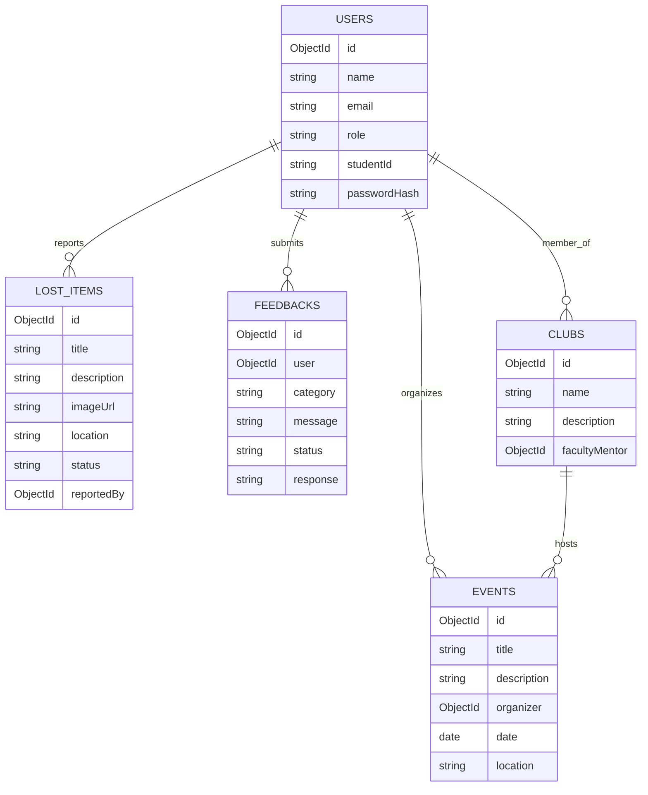

## ER Diagram (Mermaid)

```mermaid
erDiagram
  USERS {
    ObjectId id
    string name
    string email
    string role
    string studentId
    string passwordHash
  }

  EVENTS {
    ObjectId id
    string title
    string description
    ObjectId organizer
    date date
    string location
  }

  LOST_ITEMS {
    ObjectId id
    string title
    string description
    string imageUrl
    string location
    string status
    ObjectId reportedBy
  }

  FEEDBACKS {
    ObjectId id
    ObjectId user
    string category
    string message
    string status
    string response
  }

  CLUBS {
    ObjectId id
    string name
    string description
    ObjectId facultyMentor
  }

  USERS ||--o{ EVENTS : organizes
  USERS ||--o{ LOST_ITEMS : reports
  USERS ||--o{ FEEDBACKS : submits
  USERS ||--o{ CLUBS : member_of
  CLUBS ||--o{ EVENTS : hosts
```

Notes:
- Relationships use ObjectId references in Mongoose schemas.
- For performance, consider indexes on `email`, `role`, `date`, and `status` fields.
